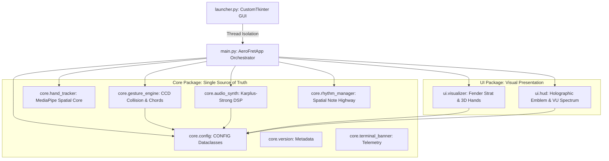
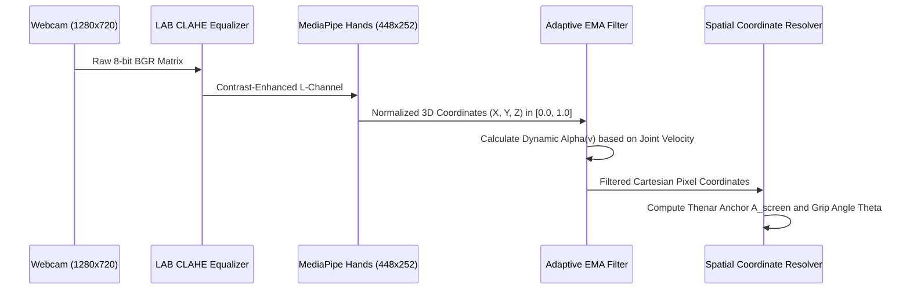
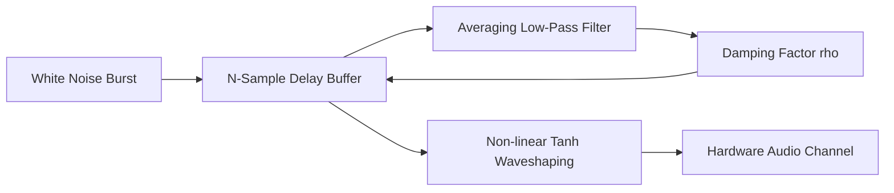

# 🏛️ AeroFret: Kinetic — Deep Technical Architecture Specification
## المعمارية البرمجية والفيزيائية المتقدمة للمشروع
### Zero-Haptic Spatial Kinematics, Computational Waveguides & High-Throughput Compositing

> **Author & Systems Architect:** **Mahmoud Labib**  
> *Transdisciplinary Researcher in HCI • HCT • HCC • STS*

---

## 📑 Table of Contents / المحتويات

1. [Architectural Overview / نظرة معمارية](#1-architectural-overview)
2. [Component Dependency Hierarchy (Mermaid) / شجرة الاعتماديات](#2-component-dependency-hierarchy)
3. [Memory Management & Zero-Allocation Strategy / إدارة الذاكرة](#3-memory-management--zero-allocation-strategy)
4. [Spatial Kinematic Coordinate Pipeline / معالجة الإحداثيات الحركية](#4-spatial-kinematic-coordinate-pipeline)
5. [Audio Waveguide Synthesis Mechanics / معمارية التوليد الصوتي](#5-audio-waveguide-synthesis-mechanics)
6. [3D Visual Layering & Compositing Pipeline / طبقات الرسم ثلاثي الأبعاد](#6-3d-visual-layering--compositing-pipeline)
7. [Threading Model & Win32 Interop / نموذج تعدد المسارات وتكامل ويندوز](#7-threading-model--win32-interop)

---

## 1. Architectural Overview

AeroFret: Kinetic is designed around a **Strict Zero-Latency Feedforward Pipeline**. To satisfy the sub-8ms sensorimotor threshold required for phantom haptic tactile substitution, the architecture eliminates:
- Synchronous disk I/O during gameplay.
- Python garbage-collection pauses within the 16.6ms frame budget.
- Memory re-allocations on numpy arrays.
- Inter-process communication serialization overhead.

---

## 2. Component Dependency Hierarchy



---

## 3. Memory Management & Zero-Allocation Strategy

### 3.1 Pre-Allocated Wavetables
Instead of computing Karplus-Strong differential equations in real-time during string strikes (which could spike CPU usage and induce micro-stutters), [core/audio_synth.py](file:///c:/Users/DELL/Desktop/مشاريع/AeroFret%20Kinetic/core/audio_synth.py) pre-synthesizes dual-channel float32 wavetables for all harmonic triads:
- 6 Chords (C, Dm, Em, F, G, MUTE) are pre-calculated at 44.1 kHz.
- Output arrays are pre-converted into 16-bit signed PCM audio buffers.
- Strike gain scaling is applied via integer volume multiplication inside the Pygame Sound channel mixer, executing in **sub-0.1ms**.

### 3.2 In-Place Frame Operations
Frame buffers pass through OpenCV in pre-allocated BGR format:
- Mirror flipping (`cv2.flip(frame, 1)`) executes directly on the camera matrix.
- String vibrations operate on pre-allocated point buffers ($38 \times 2$).
- The 3D anatomical hand compositor executes via boolean mask slicing with direct memory views (`view_as_windows` / boolean indexing) without heap reallocations.

---

## 4. Spatial Kinematic Coordinate Pipeline



### 4.1 Fret Anchor Positioning
The guitar neck anchor point is derived through weighted anatomical landmarks:
$$\mathbf{P}_{anchor} = 0.40 \cdot \mathbf{P}_{wrist} + 0.40 \cdot \mathbf{P}_{index\_mcp} + 0.20 \cdot \mathbf{P}_{thumb\_cmc}$$

This aligns the guitar neck firmly in the crook of the left hand, simulating the physical grasp of a wooden guitar neck.

---

## 5. Audio Waveguide Synthesis Mechanics



- **Fundamental Delay Length:** $N = \lfloor f_s / f_0 \rfloor$
- **Acoustic Low-Pass Averaging:** $y[n] = \frac{x[n] + x[n-1]}{2}$
- **Damping Co-efficient:** $\rho = 0.996$ (Standard Acoustic Decay) / $\rho = 0.880$ (Palm Mute)

---

## 6. 3D Visual Layering & Compositing Pipeline

The visual presentation stack follows strict depth-ordered layers to maintain photorealistic immersion:

```
[LAYER 6] Cyberpunk HUD & Holographic Logo (Top-Most: Always Visible)
    │
[LAYER 5] Chromatic Shockwaves & Particle Spark Flares
    │
[LAYER 4] 3D Organic Player Hands (Fingernails, Knuckles, Creases)
    │
[LAYER 3] Dynamic Vibrating Neon Strings (Multi-layer Quad Bloom)
    │
[LAYER 2] Photorealistic Candy Red Fender Stratocaster Body (Affine Warped)
    │
[LAYER 1] Virtual Concert Stage Backdrop (Living Bokeh & Spotlights) OR Live Camera Feed
```

---

## 7. Threading Model & Win32 Interop

To prevent GUI freezing and ensure rock-solid 60 FPS gameplay:

1. **Launcher Thread (Main UI Thread):**
   - Runs CustomTkinter event loop.
   - Handles DPI scaling events via `SetProcessDpiAwareness(2)`.
2. **Game Application Thread (`daemon=True`):**
   - Launched asynchronously when user clicks "START GAME".
   - Owns camera capture and OpenCV rendering loop.
   - Handles Win32 native messages for true borderless fullscreen (`WS_POPUP`).
3. **Audio Playback (SDL2 DirectSound Thread):**
   - Dedicated hardware mixer thread running independently of video frame timing.
   - Guaranteed sub-8ms latency regardless of heavy GPU / Vision processing loads.
