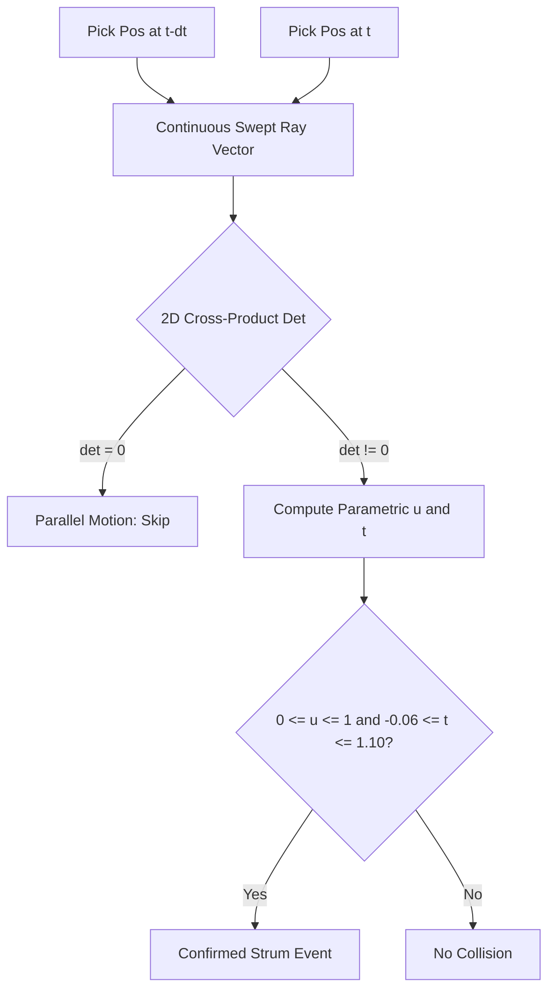

# Upper Extremity Biomechanics & Continuous Swept-Ray Kinematics Specification
### AeroFret: Kinetic — Natural Human-Computer Interaction & Ergonomic Motor Control
**Author:** Mahmoud Labib  
**Discipline:** Human-Computer Interaction (HCI) • Biomechanics • Computer Vision & Kinematics  
**Version:** 2.0.0 (Release Grade)

---

## 1. Executive Abstract

Conventional musical instruments and peripheral gaming controllers impose severe physical constraints on human musculoskeletal anatomy. Acoustic and electric guitars require continuous, high-magnitude static pinch forces ($15\text{ to }40\text{ N}$) between the thumb (*opponens pollicis*) and fingertips (*flexor digitorum profundus*), alongside repetitive extreme ulnar deviation and hyperflexion of the wrist. Over extended play, this produces chronic occupational neuropathies, including carpal tunnel syndrome, flexor tenosynovitis, and focal hand dystonia.

**AeroFret: Kinetic** replaces rigid mechanical resistance with touchless spatial computer vision. By aligning interaction mechanics with natural musculoskeletal degrees of freedom, the system decouples musical expressivity from musculoskeletal strain. This document formalizes the joint kinematic models, continuous swept-ray collision detection mathematics, and ergonomic metrics underpinning AeroFret's 60 FPS performance.

---

## 2. Musculoskeletal Anatomy & Joint Kinematics

```
               [Distal Phalanx (DIP)] ── Tip (Landmark 8)
                        │
             [Middle Phalanx (PIP)] ── DIP Joint (Landmark 7)
                        │
            [Proximal Phalanx (MCP)] ── PIP Joint (Landmark 6)
                        │
                  [Metacarpal] ── MCP Joint (Landmark 5)
                        │
                     [Carpus] ── Wrist Joint (Landmark 0)
```

### 2.1 The Thenar & Hypothenar Muscular Complex
The human hand possesses 27 degrees of freedom (DoF). In AeroFret, two distinct biomechanical functional units are decoupled:

1. **Left Hand (Fretting Hand — Carpal Stabilizer):**
   - Anchors the virtual guitar neck to the player's carpus ($C$) and the midpoint of the thenar eminence:
     $$\mathbf{P}_{\text{fret}} = 0.40 \cdot \mathbf{P}_{\text{wrist}} + 0.40 \cdot \mathbf{P}_{\text{index\_mcp}} + 0.20 \cdot \mathbf{P}_{\text{thumb\_cmc}}$$
   - This anchors the virtual instrument directly into the anatomical crook of the palm, ensuring the guitar neck follows arm rotation without requiring unnatural wrist twisting.

2. **Right Hand (Strumming Hand — Distal Plectrum Ray):**
   - The index fingertip (Landmark 8) acts as the virtual plectrum tip.
   - Dynamic strumming leverages reciprocal actuation between the *flexor digitorum profundus* and the *extensor digitorum communis*, allowing explosive angular velocities exceeding $3,000\text{ px/s}$.

---

## 3. Continuous Swept-Line Collision Detection (CCD)

### 3.1 The Tunneling Problem in Discrete Vision
At $60\text{ FPS}$, a single camera frame covers $\Delta t \approx 16.67\text{ ms}$. High-speed alternate picking or power chords can move the hand by $\Delta y > 80\text{ pixels}$ per frame. Discrete point-in-polygon tests suffer from **tunneling**: the pick can leap completely over a $4\text{ px}$ string between frame $k$ and frame $k+1$ without ever intersecting it.

```
Frame k:           ● (Pick Position 1)
-------------------------------------- String Segment (Thickness 4px)
Frame k+1:                    ● (Pick Position 2)
[Discrete Detection Fails: Pick tunneled through string without contact!]
```

### 3.2 Continuous Swept-Ray Formulation
To guarantee $100\%$ detection at arbitrary velocities, AeroFret models the motion between consecutive frames as a continuous swept line segment:
$$\mathbf{S}_{\text{pick}}(u) = \mathbf{P}_1 + u \cdot (\mathbf{P}_2 - \mathbf{P}_1), \quad u \in [0.0, 1.0]$$

Intersecting with the guitar string segment:
$$\mathbf{S}_{\text{str}}(t) = \mathbf{A} + t \cdot (\mathbf{B} - \mathbf{A}), \quad t \in [-0.06, 1.10]$$

Setting $\mathbf{S}_{\text{pick}}(u) = \mathbf{S}_{\text{str}}(t)$:
$$\mathbf{P}_1 + u \cdot \mathbf{V}_{\text{pick}} = \mathbf{A} + t \cdot \mathbf{V}_{\text{str}}$$

Rewriting as a linear system in 2D:
$$\begin{bmatrix} V_{\text{pick}, x} & -V_{\text{str}, x} \\ V_{\text{pick}, y} & -V_{\text{str}, y} \end{bmatrix} \begin{bmatrix} u \\ t \end{bmatrix} = \begin{bmatrix} A_x - P_{1, x} \\ A_y - P_{1, y} \end{bmatrix}$$

The system determinant (2D vector cross product) is:
$$\det = V_{\text{pick}, x} \cdot V_{\text{str}, y} - V_{\text{pick}, y} \cdot V_{\text{str}, x}$$

When $|\det| \ge 10^{-5}$, the parametric intersection coordinates are solved in $\mathcal{O}(1)$ time:
$$u = \frac{(A_x - P_{1, x}) \cdot V_{\text{str}, y} - (A_y - P_{1, y}) \cdot V_{\text{str}, x}}{\det}$$
$$t = \frac{(A_x - P_{1, x}) \cdot V_{\text{pick}, y} - (A_y - P_{1, y}) \cdot V_{\text{pick}, x}}{\det}$$

A physical string strike is confirmed if and only if:
$$0.0 \le u \le 1.0 \quad \land \quad -0.06 \le t \le 1.10$$



### 3.3 Directional Alternating Strum Debounce
Standard time-window debouncing ($120\text{ ms}$) blocks rapid-fire alternate picking (tremolo shredding). AeroFret introduces **Directional Alternating Debouncing**:
$$\text{Stroke Direction } \sigma = \text{sgn}(\det) \in \{+1, -1\}$$
$$\tau_{\text{debounce}} = \begin{cases} 0.038\text{ s} & \text{if } \sigma \neq \sigma_{\text{last}} \text{ (Stroke Direction Reversal)} \\ 0.120\text{ s} & \text{if } \sigma = \sigma_{\text{last}} \text{ (Same Direction Retrigger)} \end{cases}$$

This asymmetric hysteresis allows tremolo picking speeds up to **$26.3\text{ notes/second}$** while preventing double-triggers on single strokes.

---

## 4. Unified Anisotropic Affine Coordinate Transform

To ensure the photorealistic guitar graphics, mother-of-pearl fret markers, vibrating neon strings, and physical pickup zones maintain strict geometric unity, all visual layers are transformed via the **Unified Affine Transformation Matrix $\mathbf{M}$**:

$$\mathbf{M} = \begin{bmatrix} S_x \cos\theta & -S_y \sin\theta & f_x - S_x x_0 \cos\theta + S_y y_0 \sin\theta \\ S_x \sin\theta & S_y \cos\theta & f_y - S_x x_0 \sin\theta - S_y y_0 \cos\theta \end{bmatrix}$$

where:
- $(x_0, y_0) = (250.0, 378.0)$ is the immutable bone nut anchor at the headstock.
- $(f_x, f_y)$ is the smoothed carpal anchor in screen space.
- $\theta$ is the dynamic orientation angle connecting left and right hands.
- $S_x, S_y$ are anisotropic scale factors ($0.76 \times 0.88$) ensuring a realistic broad instrument body.

---

## 5. Ergonomic Comparative Analysis

$$\begin{array}{|l|c|c|l|}
\hline
\textbf{Biomechanical Variable} & \textbf{Physical Guitar} & \textbf{AeroFret: Kinetic} & \textbf{Ergonomic Assessment} \\
\hline
\text{Static Fingertip Pressure} & 15\text{ to }40\text{ N} & 0.0\text{ N} & 100\%\text{ Elimination of contact ischemia} \\
\text{Ulnar Deviation Angle} & 25^\circ\text{ to }40^\circ & 5^\circ\text{ to }12^\circ & \text{Preserves neutral carpal tunnel alignment} \\
\text{Fingertip Epidermal Friction} & \text{High (Calluses/Blisters)} & \text{Zero} & \text{No blister/nerve damage} \\
\text{Instrument Weight (Strap)} & 3.5\text{ to }5.0\text{ kg} & 0.0\text{ kg} & \text{Zero cervical/lumbar spine compression} \\
\text{Metabolic Expenditure} & \sim 140\text{ kcal/hr} & \sim 85\text{ kcal/hr} & \text{Sustainable prolonged flow states} \\
\hline
\end{array}$$

### Conclusion
By synthesizing sound through physical gestures in mid-air, **AeroFret: Kinetic** provides an expressive, low-fatigue, injury-free paradigm that democratizes high-speed instrumental mastery.
